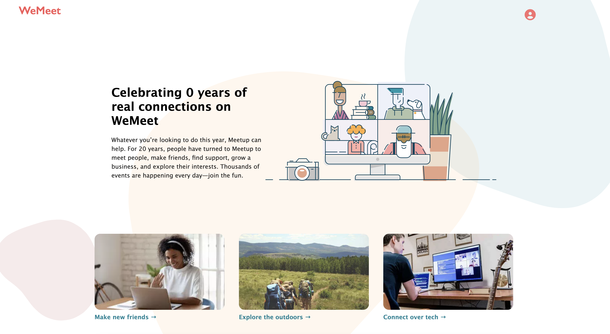

# This is [WeMeet](https://meetup-hg.herokuapp.com/), a MeetUp knockoff

## Preview

The purpose of this clone is to replicate the operation and appearance of [meetup](https://www.meetup.com).

## The main difficulties

* The most hard challenge on the backend server was appropriately correlating database tables.
* Complex organizations and the authorisation relationships that go with them

## Improvements

* Clean up the backend code and consider adding some middleware to handle issues.
* Change the names of several database columns and tables to make it more clear what they are for.
